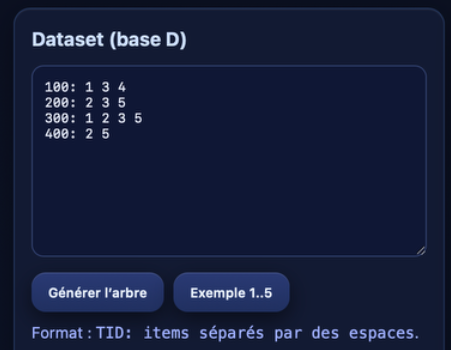
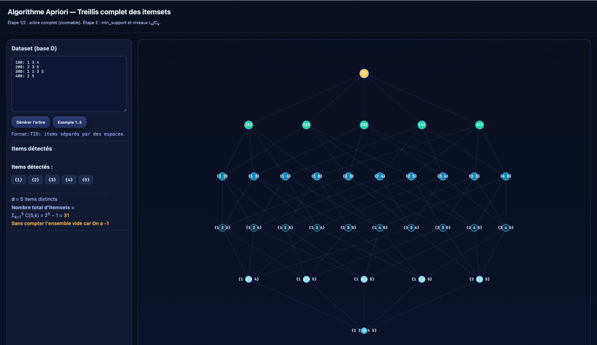
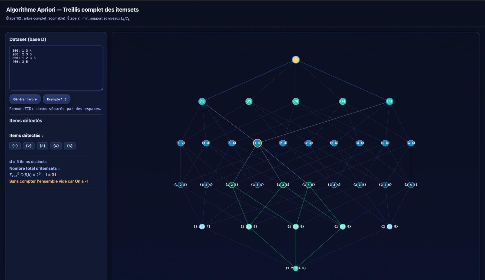
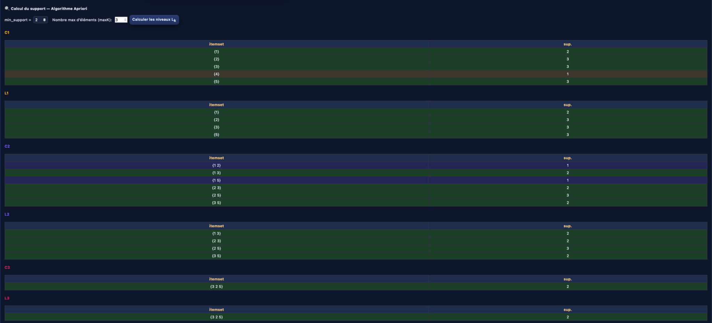
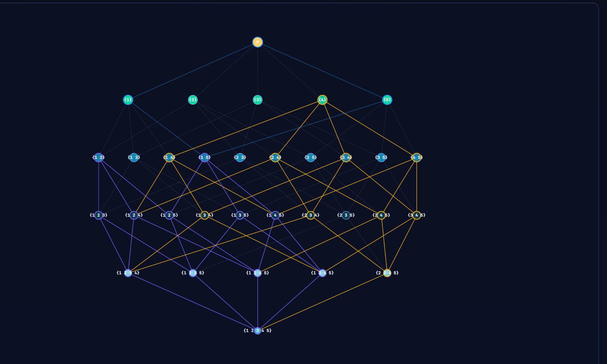
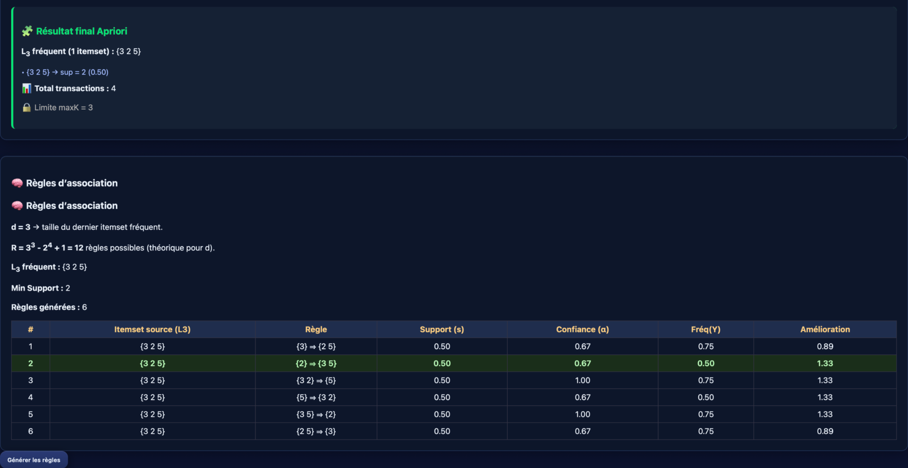

# 🌟 Algorithme Apriori — Visualisation interactive du Treillis complet des itemsets  
👨‍💻 *Développé par [Khairat Mouhcine](https://github.com/kurombo)*  

> 🧮 Une application web interactive et colorée pour comprendre visuellement l’**algorithme Apriori**.  
> Elle permet de **générer le treillis complet des itemsets**, de **calculer les niveaux fréquents (Lk/Ck)** et de **produire automatiquement les règles d’association** avec support, confiance et lift 📊.

---

## 🚀 Étapes de fonctionnement — Avec illustrations

### 🧩 Étape 1 : Chargement du dataset et détection des items
L’utilisateur saisit les transactions sous la forme :

100: 1 3 4
200: 2 3 5
300: 1 2 3 5
400: 2 5

📊 L’application identifie automatiquement les **items distincts** et calcule le **nombre total d’itemsets possibles** :  
> \( 2^d - 1 \), où \( d \) est le nombre d’items uniques.

📸 **Aperçu :**

---

### 🌳 Étape 2 : Génération du treillis complet (arbre des itemsets)
L’application construit un **treillis complet** représentant **tous les sous-ensembles possibles** des items détectés.  
Chaque nœud correspond à un itemset, et chaque arête représente une relation d’inclusion.

🧠 Le graphe est **zoomable et déplaçable**, avec surbrillance dynamique des nœuds reliés.

📸 **Aperçu :**

---

### 🎯 Étape 3 : Sélection intelligente dans le treillis
Lorsqu’on clique sur un nœud, l’interface met en surbrillance :
- 🔵 le nœud sélectionné  
- 🟢 ses **enfants** (ensembles plus grands contenant le nœud)  
- 🟣 ses **parents** (ensembles plus petits inclus dans le nœud)

Cela permet de visualiser les **relations hiérarchiques** entre itemsets.

📸 **Aperçu :**

---

### 📈 Étape 4 : Calcul du support — Algorithme Apriori
L’utilisateur choisit un **min_support** et un **maxK** (taille maximale des itemsets).  
Le système exécute l’algorithme **Apriori** :
1. Génération de tous les candidats `Ck`
2. Calcul du support pour chaque itemset
3. Filtrage des itemsets fréquents `Lk`  
4. Pruning (suppression des non-fréquents)

💡 Les tableaux `Ck` et `Lk` sont colorés selon la validité des itemsets.

📸 **Aperçu :**

---

### 🔗 Étape 5 : Génération des règles d’association
À partir du dernier niveau fréquent `Lk`, le programme génère automatiquement les **règles d’association** `X ⇒ Y` :
- Support (s)
- Confiance (α)
- Fréquence de Y
- Amélioration (lift)

🧮 Formule utilisée :
> \( R = 3^d - 2^{d+1} + 1 \)

📊 Le tableau final présente toutes les règles avec mise en évidence de la meilleure (fond vert).

📸 **Aperçu :**

---

## 🧠 Concepts clés

| Concept | Explication |
|----------|-------------|
| **Support** | Fréquence d’apparition d’un ensemble d’items |
| **Confiance** | Probabilité conditionnelle `P(Y|X)` |
| **Lift (amélioration)** | Gain de probabilité par rapport à l’indépendance |
| **Treillis** | Structure hiérarchique des sous-ensembles d’items |

---

## 🧩 Technologies utilisées

| Technologie | Rôle |
|--------------|------|
| 🧱 **HTML5** | Structure du document |
| 🎨 **CSS3**  | Design, thème sombre et effets visuels |
| ⚙️ **JavaScript (Vanilla)** | Calcul de l’algorithme Apriori et rendu SVG |
| 🧭 **SVG** | Visualisation graphique du treillis |

---

## 🧪 Auteur & Crédit

👨‍💻 **Khairat Mouhcine**  
🎓 *Projet Data Mining — EMSI Casablanca*  
📅 Version : 1.0.0  
💼 Sujet : *Visualisation de l’algorithme Apriori et extraction de règles d’association*  
🪪 Licence : [MIT](https://opensource.org/licenses/MIT)

---

✨ *« Apprendre le Data Mining, c’est apprendre à faire parler les données. »*  
💙 *Visualisez, comprenez, explorez !*
